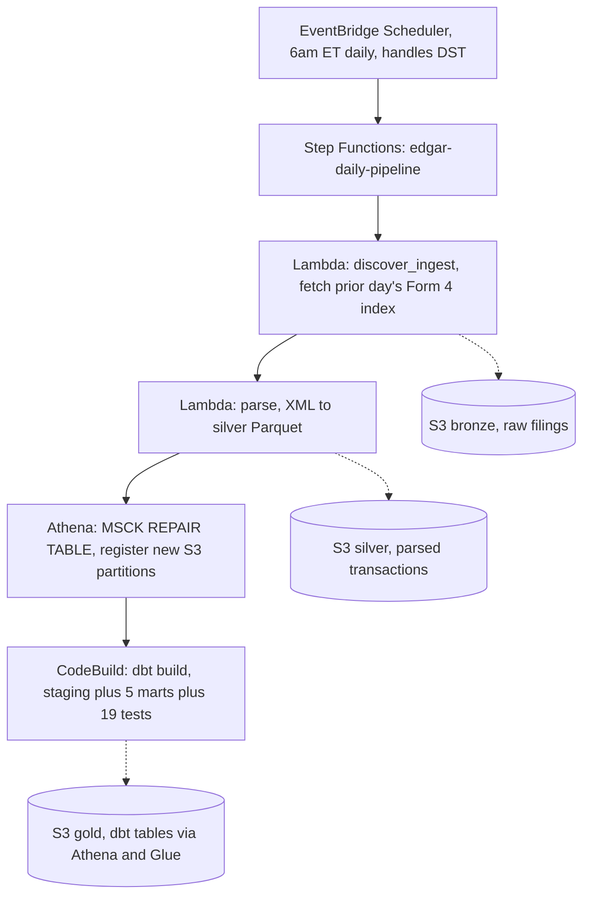

# EDGAR Insider-Trading Pipeline

An automated data pipeline that pulls SEC Form 4 insider-trading filings every day, models them into an analytics-ready warehouse, and runs on its own schedule. Built to show real data engineering and analytics engineering work, start to finish.

## What this is

When a company insider (CEO, director, large shareholder) buys or sells stock in their own company, U.S. law requires a Form 4 filing with the SEC within two business days. This pipeline pulls those filings directly from SEC EDGAR, parses the raw XML into a clean transaction table, and builds a modeled set of tables on top using dbt. It runs automatically every morning before U.S. markets open.

No synthetic data. No third-party API wrapper for the core parsing. The messy parts (XML formats that change across filing years, name variants across filers, non-equity instruments filed through equity fields) are handled directly, because that is the actual engineering problem worth solving.

## Architecture



**Storage layers:**
- **Bronze**: raw Form 4 filings as fetched from EDGAR, kept untouched so they can be re-processed from source
- **Silver**: parsed into a 23-column transaction table (Parquet), incremental and idempotent (only new filings get processed)
- **Gold**: dbt staging model plus 5 marts, queried through Athena over the Glue Data Catalog

## Tech stack

| Layer | Tools |
|---|---|
| Ingestion | Python (`requests`, `pandas`) |
| Storage | S3 (bronze, silver, gold) |
| Query engine | Athena and Glue Data Catalog |
| Modeling | dbt-athena-community |
| Compute | AWS Lambda (containerized), AWS CodeBuild |
| Orchestration | AWS Step Functions (Standard) |
| Scheduling | Amazon EventBridge Scheduler |
| IAM | Scoped roles per service, built step by step from real access errors, not guessed upfront |

## Repo structure

```
scripts/
  fetch.py, ingest.py, parse.py   # bronze and silver pipeline logic
  storage.py                      # local/S3 backend switch
  config.py, utils.py             # shared config and helpers
  driver.py                       # multi-day local driver (weekend/holiday handling)
  dummy.py                        # manual backfill script
  sql/silver_table.sql            # Athena table definition for silver
lambda_handlers/
  discover_ingest_handler.py      # Lambda wrapper for discover() and ingest()
  parse_handler.py                # Lambda wrapper for parse()
edgar_dbt/
  models/staging/form4/           # staging view, source, and tests
  models/marts/core/              # 5 marts and referential-integrity tests
Dockerfile.discover_ingest        # Lambda container image
Dockerfile.parse                  # Lambda container image
Dockerfile.codebuild_dbt          # CodeBuild container image (Debian based, not Lambda base)
*-permissions.json, trust-policy*.json, ecr-lifecycle-policy.json
                                   # IAM policy files, kept as a record of what is applied
```

## The pipeline, step by step

1. **`discover_ingest` (Lambda)**: figures out "yesterday," pulls that day's Form 4 index from EDGAR, writes the raw filings to S3 bronze. Handles weekends, EDGAR holiday closures, and real errors as three separate cases.
2. **`parse` (Lambda)**: checks which filings are already in silver, parses only the new ones from XML into the transaction table, and appends them to S3 silver.
3. **Athena `MSCK REPAIR TABLE`**: registers any new S3 partitions in the Glue catalog. This step is needed because Athena does not automatically notice new partitions from files that were just written.
4. **CodeBuild `dbt build`**: runs the full dbt project (1 staging model, 5 marts, 19 tests) against the now up-to-date silver data.

All four steps run inside one Step Functions state machine. Each step waits for the one before it to finish, so nothing moves on before the previous step is actually done. EventBridge Scheduler triggers the whole thing every day at 6am ET, using a real timezone (`America/New_York`) instead of a fixed UTC offset, so it does not drift when clocks change for daylight saving.

## Data model

- **`stg_form4_transactions`** (view): 23-column pass-through from silver, with light renaming and typing.
- **`fct_transactions`** (table): one row per transaction. Adds `transaction_classification` (Buy, Sell, Merger Disposition, or Other), `dollar_value`, and `is_debt_security`. That last flag was added after a real bond, filed through Form 4's stock fields, produced a $1.6 quadrillion outlier during testing. It was traced back to the source, confirmed to be parsed correctly, and flagged instead of deleted.
- **`dim_issuers`, `dim_owners`** (tables): one row per company or person (by CIK), keeping only the most recent filing's name and details. Older names are not kept, and matching similar names across different CIKs was left out on purpose, after checking and finding nothing to match.
- **`agg_issuer_activity`, `agg_owner_activity`** (tables): buy and sell counts and dollar totals per company or person, with debt excluded. Checked against the raw transaction rows directly, not just by comparing row counts.

There are 25 dbt tests across these models (checking for missing values, valid values, uniqueness, and correct references between tables). All 25 currently pass.

## Key decisions and why

**Athena instead of Redshift.** Athena only charges for what you query and has no cost when idle. Redshift Serverless charges for capacity even when it is not being used. For a small workload like this, Athena is simpler and cheaper.

**Step Functions and EventBridge instead of Airflow.** A pipeline that is supposed to run every day on its own needs to keep running even if your laptop is off. Local Airflow stops when your computer is off. Managed Airflow (MWAA) stays on, but costs money even when idle. Step Functions and EventBridge stay on and cost close to nothing at this scale.

**CodeBuild instead of Lambda for running dbt.** dbt was first set up to run inside Lambda, like the other two functions. It kept failing with an error tied to Python's multiprocessing. The real cause: Lambda's environment has no `/dev/shm`, and dbt always tries to use it when it starts up, no matter what settings are used. This is a known, confirmed limitation of running dbt inside Lambda, not something fixable with a setting. CodeBuild runs full containers that do have `/dev/shm`, so the problem does not come up there at all.

**EventBridge Scheduler instead of the older EventBridge Rules.** The older Rules only support UTC time, so a fixed schedule would slowly drift by an hour twice a year as clocks change. EventBridge Scheduler supports real timezones and adjusts for daylight saving automatically. Using the right tool solves the problem, instead of writing extra code to work around it.

**Adding an explicit partition repair step.** New files in S3 are not automatically visible to Athena as new partitions. This was found as a real bug: `fct_transactions` kept showing an old row count even after new data had been added, because Athena was still looking at old partition information. It was caught by comparing row counts at every stage (how many rows Lambda wrote, how many Athena could see, how many dbt built), not by trusting that the pipeline ran without errors. The fix was to add a clear repair step to the pipeline, rather than hiding it inside the dbt step.

## Cost

Built to stay inside AWS's free tier. S3, Lambda, Step Functions, and EventBridge Scheduler cost close to nothing at this scale. CodeBuild gives 100 free build-minutes per month, and a daily dbt build (about 25 to 30 seconds) rounds up to roughly 1 billed minute per day, which is well inside that limit. Expected cost: $0 per month.

## Current status

The full pipeline (ingest, parse, model, orchestrate, schedule) is built and running on its own every day. Row counts have been checked and are consistent, with no gaps, as of the last verified run.

**Not built yet:**
- An AI agent layer that can answer questions by planning, querying, and checking its own results (using direct function calls, not retrieval or RAG)
- A way to test and measure how well that agent performs
- A dashboard
- Matching similar names or entities across different CIKs (left out on purpose for now)

## A note on how this was built

Every part described here, the parsing logic, the entity matching approach, the orchestration design, and every fix listed above, was built from scratch for this project. The overall patterns used (layered storage, star-schema style modeling, an agent that calls tools) are common patterns in the field, not something invented here. What is original is applying them to this real, messy, publicly available dataset.