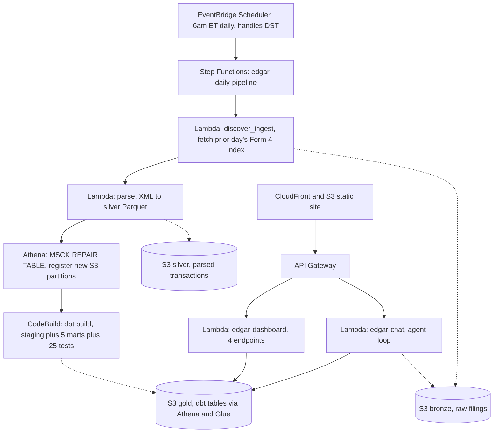

# EDGAR Insider-Trading Pipeline

An automated data pipeline that pulls SEC Form 4 insider-trading filings every day, models them into an analytics-ready warehouse, runs on its own schedule, and serves the results through a public dashboard with a question-answering agent on top.

**Live site:** https://d1mpwilwebyjo4.cloudfront.net

## What this is

When a company insider (CEO, director, large shareholder) buys or sells stock in their own company, U.S. law requires a Form 4 filing with the SEC within two business days. This pipeline pulls those filings directly from SEC EDGAR, parses the raw XML into a clean transaction table, and builds a modeled set of tables on top using dbt. It runs automatically every morning before U.S. markets open.

No synthetic data. No third-party API wrapper for the core parsing. The messy parts (XML formats that change across filing years, name variants across filers, non-equity instruments filed through equity fields) are handled directly, because that is the actual engineering problem worth solving.

## Architecture


```mermaid
flowchart TD
    A[EventBridge Scheduler, 6am ET daily, handles DST] --> B[Step Functions: edgar-daily-pipeline]
    B --> C[Lambda: discover_ingest, fetch prior day's Form 4 index]
    C --> D[Lambda: parse, XML to silver Parquet]
    D --> E[Athena: MSCK REPAIR TABLE, register new S3 partitions]
    E --> F[CodeBuild: dbt build, staging plus 5 marts plus 25 tests]
    C -.-> S3B[(S3 bronze, raw filings)]
    D -.-> S3S[(S3 silver, parsed transactions)]
    F -.-> S3G[(S3 gold, dbt tables via Athena and Glue)]

    G[CloudFront and S3 static site] --> H[API Gateway]
    H --> I[Lambda: edgar-dashboard, 4 endpoints]
    H --> J[Lambda: edgar-chat, agent loop]
    I --> S3G
    J --> S3G
    J -.-> S3B
```

**Storage layers:**
- **Bronze**: raw Form 4 filings as fetched from EDGAR, kept untouched so they can be re-processed from source
- **Silver**: parsed into a 23-column transaction table (Parquet), incremental and idempotent (only new filings get processed)
- **Gold**: dbt staging model plus 5 marts, queried through Athena over the Glue Data Catalog

## Tech stack

| Layer | Tools |
|---|---|
| Ingestion | Python (`requests`, `pandas`) |
| Storage | S3 (bronze, silver, gold) |
| Query engine | Athena and Glue Data Catalog |
| Modeling | dbt-athena-community |
| Compute | AWS Lambda (containerized), AWS CodeBuild |
| Orchestration | AWS Step Functions (Standard) |
| Scheduling | Amazon EventBridge Scheduler |
| Agent | Groq (`openai/gpt-oss-20b`), hand-written tool-calling loop |
| Serving | API Gateway (HTTP API), Lambda, S3 static site, CloudFront |
| IAM | Scoped roles per service, built step by step from real access errors, not guessed upfront |

## Repo structure

```
scripts/
  fetch.py, ingest.py, parse.py   # bronze and silver pipeline logic
  storage.py                      # local/S3 backend switch
  config.py, utils.py             # shared config and helpers
  driver.py                       # multi-day local driver (weekend/holiday handling)
  dummy.py                        # manual backfill script
  agent.py                        # tool-calling agent loop
  athena_client.py                # query runner, read-only check, result trimming
  bronze_fetch.py                 # pulls raw filing XML back out of bronze
  schema.py                       # table description given to the model
  sql/silver_table.sql            # Athena table definition for silver
lambda_handlers/
  discover_ingest_handler.py      # Lambda wrapper for discover() and ingest()
  parse_handler.py                # Lambda wrapper for parse()
  dashboard_handler.py            # 4 read endpoints for the site
  chat_handler.py                 # wraps agent.ask()
edgar_dbt/
  models/staging/form4/           # staging view, source, and tests
  models/marts/core/              # 5 marts and referential-integrity tests
dashboard.html                    # the site, single self-contained file
Dockerfile.discover_ingest        # Lambda container image
Dockerfile.parse                  # Lambda container image
Dockerfile.codebuild_dbt          # CodeBuild container image (Debian based, not Lambda base)
Dockerfile.dashboard              # Lambda container image
Dockerfile.chat                   # Lambda container image
*-permissions.json, trust-policy*.json, ecr-lifecycle-policy.json
                                   # IAM policy files, kept as a record of what is applied
```
# IAM policy files, kept as a record of what is applied


## The pipeline, step by step

1. **`discover_ingest` (Lambda)**: figures out "yesterday," pulls that day's Form 4 index from EDGAR, writes the raw filings to S3 bronze. Handles weekends, EDGAR holiday closures, and real errors as three separate cases.
2. **`parse` (Lambda)**: checks which filings are already in silver, parses only the new ones from XML into the transaction table, and appends them to S3 silver.
3. **Athena `MSCK REPAIR TABLE`**: registers any new S3 partitions in the Glue catalog. This step is needed because Athena does not automatically notice new partitions from files that were just written.
4. **CodeBuild `dbt build`**: runs the full dbt project (1 staging model, 5 marts, 25 tests) against the now up-to-date silver data.

All four steps run inside one Step Functions state machine. Each step waits for the one before it to finish, so nothing moves on before the previous step is actually done. EventBridge Scheduler triggers the whole thing every day at 6am ET, using a real timezone (`America/New_York`) instead of a fixed UTC offset, so it does not drift when clocks change for daylight saving.

## Data model

- **`stg_form4_transactions`** (view): 23-column pass-through from silver, with light renaming and typing.
- **`fct_transactions`** (table): one row per transaction. Adds `transaction_classification`, `dollar_value`, and five quality flags: `is_debt_security`, `is_nonstandard_pricing`, `dollar_value_unreliable`, `is_empty_transaction`, and `has_no_price`. Each flag came from a real problem found in the data, traced to the source filings, and flagged rather than deleted.  
- **`dim_issuers`, `dim_owners`** (tables): one row per company or person (by CIK), keeping only the most recent filing's name and details. Older names are not kept, and matching similar names across different CIKs was left out on purpose, after checking and finding nothing to match.
- **`agg_issuer_activity`, `agg_owner_activity`** (tables): buy and sell counts and dollar totals per company or person. Rows with unreliable dollar values are excluded from the totals, and rows with no transaction data are excluded from the counts. Checked against the raw transaction rows directly, not just by comparing row counts.

There are 25 dbt tests across these models (checking for missing values, valid values, uniqueness, and correct references between tables). All 25 currently pass.

## The agent

`scripts/agent.py` runs a plan, act, observe, correct loop in plain Python. No agent framework. The model gets two tools: run a read-only SQL query against Athena, and fetch the raw XML of one specific filing out of bronze. It writes its own SQL from a table description in the prompt, reads the result, and decides whether to query again or answer.

It does correct itself. In one run, its first query used `ILIKE`, which Athena's engine does not support. The query failed, the model read the error, and rewrote it with `LIKE` and `lower()` without being told what was wrong.

This is direct function calling, not RAG. There is no vector store, no embeddings, and no retrieval step. There is also no conversation memory: each question starts fresh.

## Guardrails

Two layers, and only one of them is the real defense.

**IAM.** The agent's roles have read-only access to Athena, Glue, and S3, with write access limited to the Athena query results folder. No permission to delete objects or to create, alter, or drop tables. This was tested, not assumed: a real `DROP TABLE` was run through the agent's own credentials, failed with an access-denied error on `glue:DeleteTable`, and the table's row count was checked before and after to confirm nothing changed.

**A text check in code.** `is_read_only()` rejects any query that does not start with SELECT or WITH before it reaches Athena. This is a fast rejection for obvious cases, not a security boundary. A query starting with `WITH` and containing a `DELETE` would pass this check. It is then rejected by Athena's own SQL grammar, which is another reason the IAM layer is the one that matters.

## Dashboard and chat

A single self-contained HTML file on S3, served through CloudFront with the bucket kept private. Four read endpoints behind API Gateway, all backed by one Lambda: top trades by day with date navigation, flagged anomalies with the explanation text pulled from the original filing, issuer search, and most active companies. The chat panel calls a second Lambda that wraps the agent.

## Data quality findings

**Rows with no transaction data.** A Form 4 has two sections, one for ordinary stock transactions and one for derivatives such as options, RSUs and DSUs. This pipeline parses only the first. When a filing holds nothing but derivative activity, a row is still written with the filing metadata and every trade field null. That is 8.1% of the table, unevenly spread: one issuer had 15 of its 18 rows in this state, so a naive count reported 18 transactions where 3 trades had actually occurred. Flagged with `is_empty_transaction` and excluded from aggregate counts. Parsing derivative transactions properly is a known gap, not yet built.

**Rows with a share count and no price.** 6.1% of the table. These are real transactions with no dollar value attached, such as gifts, awards, and some option exercises. Flagged with `has_no_price`, counted as transactions, and contributing nothing to dollar totals.  

## Key decisions and why

**Athena instead of Redshift.** Athena only charges for what you query and has no cost when idle. Redshift Serverless charges for capacity even when it is not being used. For a small workload like this, Athena is simpler and cheaper.

**Step Functions and EventBridge instead of Airflow.** A pipeline that is supposed to run every day on its own needs to keep running even if your laptop is off. Local Airflow stops when your computer is off. Managed Airflow (MWAA) stays on, but costs money even when idle. Step Functions and EventBridge stay on and cost close to nothing at this scale.

**CodeBuild instead of Lambda for running dbt.** dbt was first set up to run inside Lambda, like the other two functions. It kept failing with an error tied to Python's multiprocessing. The real cause: Lambda's environment has no `/dev/shm`, and dbt always tries to use it when it starts up, no matter what settings are used. This is a known, confirmed limitation of running dbt inside Lambda, not something fixable with a setting. CodeBuild runs full containers that do have `/dev/shm`, so the problem does not come up there at all.

**CodeBuild runs dbt from its container image, not from git.** The project is configured as `NO_SOURCE`, so dbt runs against the models baked into `Dockerfile.codebuild_dbt`. A model change ships by rebuilding and pushing that image. Pushing to git alone leaves the deployed models unchanged, and the next scheduled run will rebuild the tables from the image's older SQL.

**EventBridge Scheduler instead of the older EventBridge Rules.** The older Rules only support UTC time, so a fixed schedule would slowly drift by an hour twice a year as clocks change. EventBridge Scheduler supports real timezones and adjusts for daylight saving automatically. Using the right tool solves the problem, instead of writing extra code to work around it.

**Adding an explicit partition repair step.** New files in S3 are not automatically visible to Athena as new partitions. This was found as a real bug: `fct_transactions` kept showing an old row count even after new data had been added, because Athena was still looking at old partition information. It was caught by comparing row counts at every stage (how many rows Lambda wrote, how many Athena could see, how many dbt built), not by trusting that the pipeline ran without errors. The fix was to add a clear repair step to the pipeline, rather than hiding it inside the dbt step.

**Writing the agent loop by hand instead of using a framework.** The loop is short enough to write directly, and writing it directly means the token cost, the step limit, and the failure handling are all visible and adjustable. A framework would have hidden exactly the parts that turned out to need fixing.

## Anomalies found in the data

Large outliers in `dollar_value` were traced back to the original filings using the agent's own filing-fetch tool. Four have explanations:

- A bond reported through the stock fields, where the price was the total principal of a note issue (Angel Oak Financial Strategies Income Term Trust, about $1.6 quadrillion).
- A debt-to-equity conversion, explained in the filing's own remarks field (InnSuites Hospitality Trust, about $5.49 trillion).
- A bond redemption where the shares field held the dollar face value of the redeemed notes (DNP Select Income Fund, about $1.1 quadrillion).
- A purchase at $180,000 per share that is genuinely in the raw filing with no remarks or footnotes anywhere (Reborn Coffee). No explanation found. Left flagged and open rather than quietly corrected.

One more, a second InnSuites sale at $22,593.60 per share, is still untraced.

## Cost

Built to stay inside AWS's free tier. S3, Lambda, Step Functions, and EventBridge Scheduler cost close to nothing at this scale. CodeBuild gives 100 free build-minutes per month, and a daily dbt build (about 25 to 30 seconds) rounds up to roughly 1 billed minute per day, which is well inside that limit. The model runs on Groq's free tier. Expected cost: $0 per month.

## Current status

The pipeline (ingest, parse, model, orchestrate, schedule) is built and running on its own every day. The dashboard and the agent are built and deployed, and the site is public. Row counts have been checked and are consistent, with no gaps, as of the last verified run.

**Known limitations:**

- The chat is not reliable in production. The agent itself works and gives accurate answers, but API Gateway's HTTP API has a fixed 30 second timeout that cannot be raised, and inference latency on the model provider's free tier swings between 4 and 25 seconds per call with no warning. A multi-step question needs several calls, so on a slow day every request exceeds the ceiling. Trimming query results, cutting the step limit from 8 to 4, and moving to a smaller model all helped and none of them fix it. The right fix is to run the agent as a background job and have the browser poll for the result, which removes the ceiling entirely. Not built yet.
- No evaluation harness. There is no test set of questions with known answers, so answer quality is checked by querying Athena by hand and comparing. That caught several real errors, but it does not scale.
- The agent has no memory between questions.
- Derivative transactions are not parsed, which is what produces the empty rows described above.
- No matching of similar names or entities across different CIKs.

## A note on how this was built

Every part described here, the parsing logic, the orchestration design, the agent loop, and every fix listed above, was built from scratch for this project. The overall patterns used (layered storage, star-schema style modeling, an agent that calls tools) are common patterns in the field, not something invented here. What is original is applying them to this real, messy, publicly available dataset.
